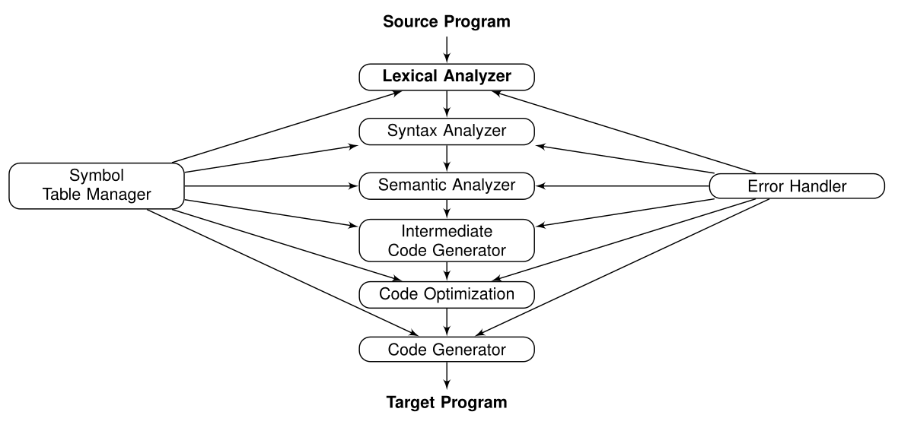

# Viva Notes

## Process of compiling a source code (C source)

A C code goes through:

1. Pre-processor
2. Compiler
3. Assembler
4. Linker & Loader

and then generates an executable binary.

### Pre-processor

Handles any statement that begins with `#`.

Primary jobs:

- **File Inclusion** like including header files inside the source file. E.g `#include <stdio.h>` will be treated by pre-processor by expanding this line with the contents of `stdio.h`.
- **Macro Expansion** like if we specify macro constants or functions and then use them in the code, pre-processor will expand those with the actual definition. Like `#define PI 3.14`, where ever we have used `PI` it will be replaced by `3.14`. Same applies to functions like `#define square(x) (x*x)`.
- **Conditional Macros** like when we use `#if`, `#ifndef`, `#else` to instruct the pre-processor whether to include a block of code or not. This expressions are evaluated by pre-processor itself.

### Compiler

- Converts the pre-processed source code to assembly code.
- Checks for errors (compile-time errors like lexical, syntactical and semantic errors).

### Assembler

- Converts assembly code by compiler to machine level code.

### Linker & Loader

- **Linker** links the object files together and resolves symbolic addresses to numerical addresses.
- **Loader** is responsible for loading executable files into memory and execute them.

## Other language processors

There are other ways to convert HLL (High Level Language) code to LLL (Low Level Language) code.

### Interpreter

- Translates program one statement at a time.
- Directly execute the operations specified in the source program on inputs
supplied by the user.

E.g, `Python`, `Ruby`, `Perl`.

### JVM (Java Virtual Machine)

- Initially the source code is translated to `bytecode`.
- `bytecode` can then be run on a virtual machine.
- follows _"Write once, run anywhere"_ principle.

## Phases of a compilation

These are the following phases of compilation

1. Lexical Analyzer
2. Syntax Analyzer
3. Semantic Analyzer
4. Intermediate Code Generator
5. Code Optimizer
6. Code Generator

At each phase, it interacts with the **Symbol Table Manager** and for errors it reaches to the **Error Handler**.



## Phases in tabular format

| Phase | Input | Output |
|---|---|---|
| Lexical Analyzer | (pre-processed) Source Code | Tokens |
| Syntax Analyzer | Tokens | Syntax/Parse Tree |
| Semantic Analyzer | Syntax/Parse Tree | Annotated Syntax/Parse Tree | 
| Intermediate Code Generator | Annotated Syntax/Parse Tree | Intermediate Code |
| Code Optimizer | Intermediate Code | Intermediate Optimized Code |
| Code Generator | Intermediate Optimized Code | Assembly Code |

> NOTE: Input of a particular phase is the output of the previous phase.

## Model of Compilations

The different phases of compilations can be broadly classified into:

1. **Analysis Phase** breaks up the source program into constituent pieces and creates an intermediate representation of the source program, also detects errors. Lexical Analyzer, Syntax Analyzer and Semantic Analyzer comes under Analysis Phase.
2. **Synthesis Phase** constructs the desired target program from the intermediate representation and the information in the symbol table. Intermediate Code Generator, Code Optimizer and Code Generator come under Synthesis Phase.

### Lexical Analyzer

- Converts input program into stream of tokens by grouping characters together.
- Makes entry into the Symbol Table.
- Ignores/Deletes comments and whitespaces.
- Correlating error messages from the compiler with the same source program.

#### Lexemes

- A lexeme is a sequence of characters in the source program that matches the pattern for a token.
- Smallest logical unit (words) of a program.

#### Token

- A token is a smallest lexical unit.
- It is a pair consisting of a **token name** and an optional **attribute value**. The attribute value is usually a reference to the symbol table.
- **Token name** is an abstract symbol representing a kind of lexical unit. E.g, `INT_TOK` representing `int`, `WHILE_TOK` representing `while`.

> NOTE: There is a _many-to-one_ relationship b/w lexemes and tokens. E.g, `123`, `1001`, `101` lexemes all come under the token `INTCONST`.

#### Maximal Match Rule (or Longest Prefix Match)

- If a prefix is matching two patterns then the longer match will be considered.
- If both patterns are of same length, then the one that came first will be considered.

```c
int x = y+++z;
```

In the above example, `+++` will be treated as {`INCREEMENT_TOK`, `PLUS_TOK`}. Even though, `+` itself matches the `PLUS_TOK` rule, still `++` is a longer prefix so it will be considered first as `INCREEMENT_TOK`.

#### Symbol table

- Data structure (can be array, hash table) to keep track of identifiers like variables and functions.
- For variables it contains details like:
  - token-name
  - value
  - address
  - data type
- For functions it contains details like:
  - number of arguments
  - return type
- A compiler can maintain multiple symbol table, one for each scope, one for variables, one for methods etc. (Varies from compiler to compiler).

## Lex tool

- Lex is a Scanner Generator that produce lexical analyzers from a regular expression.
- Lex reads patterns from the `*.l` file and generates a lexical analyzer function `yylex` in the file `lex.yy.c`.

### Lex Structure

```c
...definitions...
%%
...rules...
%%
...subroutines...
```

- **definitions**: we define the regular expressions
- **rules**: we specify the corresponding action in case a pattern matches
- **subroutines**: we specify the main logic

In the rules, we follow:

```text
<regex pattern> <action (optional)>
```

The action maybe a single C statement or multiple C statements enclosed in braces.

> NOTE: stuff to be copied verbatim into the flex output enclosed in `%{ ..... }%`, or (e.g., `declarations`, `#includes`)

### Lex library routines

- **yylex()** main entry-point for lex.
- **yymore()** 	return the next token.
- **yyless(n)** return the first n characters in `yytext`.
- **yywrap()** called by lex when the input is exhausted. (return 1 if done, 0 otherwise)

### Lex pre-defined variables

- **yytext** pointer to the matched string (NULL terminated) or lexeme.
- **yyleng** length of the matched string (or lexeme).
- **yyout** output file (default: `stdout`).
- **yyin** the input stream pointer (default: `stdin`).

### Compile Lex file

```bash
$ lex lex.l # this generates a lex.yy.c file

$ gcc lex.yy.c -ll # the flag to link the lex library and generates a.out binary

$ ./a.out input.c # run the lexer
```